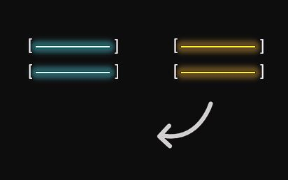

# Py-Training: Practise

## Pandas + NumPy
#### 1. To drop duplicates | `drop_duplicates`
```python
drivers['driver_id'].drop_duplicates(inplace = True)
```
<br/>

#### 2. Null handling | `isnull`, `fillna`, `dropna`
```python
vehicles.isnull().sum()   # to count the number of null
vehicles.fillna(0, inplace = True)   # to fill values
vehicles.dropna()   # to drop
```
<br/>

#### 3.1. Data Categorization | `.loc[condition, 'col']`
```python
drivers.loc[drivers['rating'] >= 4, 'Status'] = "Elite"
```
<br/>

#### 3.2. Data Categorization | `fn = lambda` and `apply(fn)`
```python
cat_status = lambda x: "Elite" if x >= 4 else "Poor" if x<=2 else "Average"
drivers['Status'] = drivers['rating'].apply(cat_status)
```
<br/>

#### 4.1. Simple group to check size
```python
drivers.groupby(['Status']).size()
```
<br/>

#### 4.2. Grouping or aggregating data | partition by = groupby
```python
rides_grouped = rides_time.groupby('driver_id').agg(
    total_time = ('Time', 'sum'),
    average_fare = ('fare_amount', 'mean')
).reset_index()
```
<br/>

#### 4.3. over(order by ) = .rank(ascending = False)
```python
rides_grouped['rank'] = rides_grouped['total_time'].rank(method = 'dense', ascending = False)
```
<br/>

#### 5. Filtering based on condition
```python
elites_available = drivers.loc[(drivers['Status'] == "Elite") & (drivers['available'] == True)]
```
<br/>

#### 6. Ranking | dense 1,1,2 | min 1,1,3
```python
elites_available['rating'].rank(method = 'dense', ascending = False)
```
<br/>

#### 7.1. Joins | merge() (SQL-like Joins)
```python
drivers_vehicles = pd.merge(drivers, vehicles, how = "left", on = 'vehicle_id')
```
<br/>

#### 7.2. Joins | concat() (Stacking Datasets)
```python
# Stack datasets vertically (like UNION in SQL)
df_concat = pd.concat([drivers, vehicles], axis=0)  # axis=0 → Rows

df_concat = pd.concat([drivers, vehicles], axis=1)  # axis=1 → Columns
```
<br/>

#### 8. Finding index
```python
# Find the row index where driver_id is 2
index = rides[rides['driver_id'] == 2].index
```
<br/>

#### 9. NumPy | Reverse a list
```python
u_col_list[:10][::-1]
```
<br/>

#### 10. Converting to vectors | `.reshape(R,C)`

arr.reshape(-1, 1) | column vector | FIGURE OUT ROWS (-1), I WANT COLUMN AS 1 SO 1D COLUMN VECTOR (1) <br/>

When using -1 in .reshape(), NumPy will figure out the appropriate size for that dimension based on the total number of elements in the array and the other specified dimensions.
```python
# Convert into a column vector (189, 1)
reshaped_arr = arr.reshape(-1, 1)
```

```python
# Convert into a row vector
reshaped_arr = arr.reshape(1, -1)
```

#### [View code](https://github.com/s1dewalker/py-training/blob/main/py_Training.ipynb)
<br/>

## Fn + lamda

#### [View code](https://github.com/s1dewalker/py-training/blob/main/py_training_fn_lmbda.ipynb)
<br/>

## NumPy only

#### 1. to convert to array | `np.array(a)`

Q. why convert to numpy array (from list)?
faster, memory efficient, supports vector operations, integrate well with scientific libraries.

#### 2. reverse | `arr[::-1]`
#### 3. `np.reshape(arr, (2,3))`
#### 4. `arr.flatten()`
#### 5. `np.concatenate( [arr1, arr2] )`
axis = 0 by default

#### axis = 0




#### 6. `np.prod(mat, axis = 1)` | same for np.sum, mean, var, std, min, max
axis = 0 by default

by default most (if not all) have axis = 0 | across rows | vertical ops

#### 7. `arr1.reshape(-1,1)`

#### [View code](https://github.com/s1dewalker/py-training/blob/main/numpy.ipynb)
<br/>

## Web Scraping
```python
# Import libraries
from bs4 import BeautifulSoup
import requests
```

```python
# get the web data

url = 'https://en.wikipedia.org/wiki/List_of_largest_companies_in_the_United_States_by_revenue'
page = requests.get(url)
soup = BeautifulSoup(page.text, 'html')
print(soup.prettify)
```
```python
# To find all tables and then get the required one from the list
table = soup.find_all('table')[0]
```
```python
# To get titles
titles = table.find_all('th')

table_titles = [title.text.strip() for title in titles]
```

#### [View code](https://github.com/s1dewalker/py-training/blob/main/Web_Scraping.ipynb)

